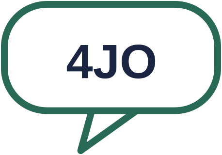
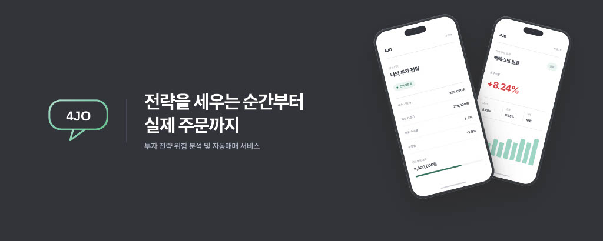
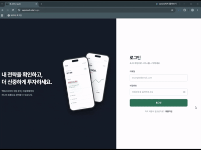
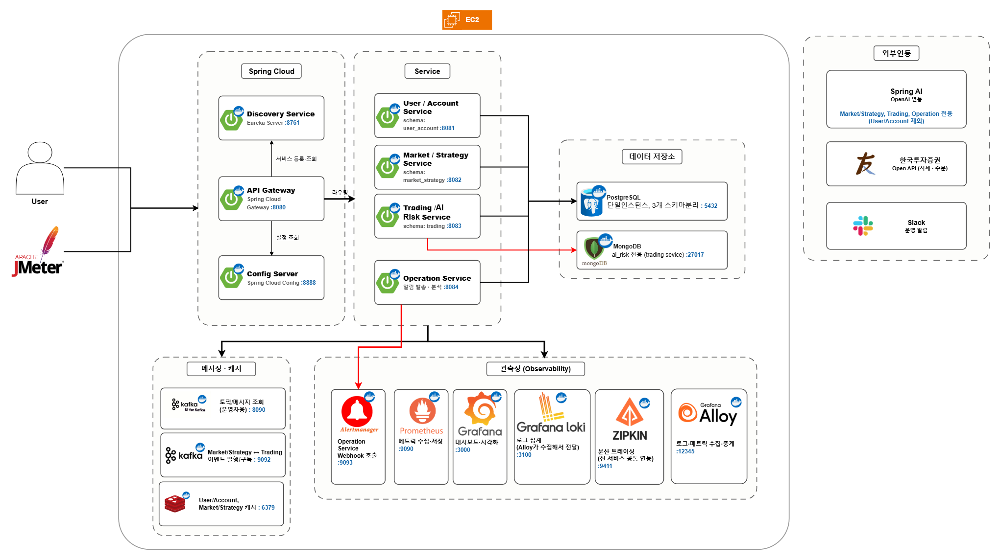
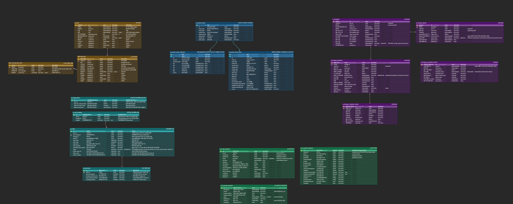

<h1>
  
  &nbsp;4JO
</h1>

<p align="center">
  
</p>

### 투자 전략 위험 분석 및 자동매매 서비스

> **전략을 세우는 순간부터 실제 주문까지.**  
> 백테스트와 AI 위험 분석을 거쳐 나만의 투자 전략을 자동매매로 연결합니다.

<br>

## 📌 Project Overview

### 📝 프로젝트 소개

4JO는 사용자가 직접 설정한 투자 전략을 기반으로  
**백테스트 → AI 위험 분석 → 사용자 승인 → 실시간 전략 평가 → 자동매매**까지 연결하는 국내 주식 자동매매 서비스입니다.

단순히 조건을 만족하면 주문을 실행하는 자동매매가 아니라,  
**전략이 실제 주문으로 이어지기까지의 검증 과정**에 집중했습니다.

- 사용자가 종목과 매수·매도 조건을 기반으로 투자 전략을 설정합니다.
- 과거 데이터를 기반으로 백테스트를 수행하고 수익률과 위험 지표를 제공합니다.
- 전략과 백테스트 결과를 기반으로 AI가 위험 요소와 판단 근거를 분석합니다.
- 분석 결과를 확인한 뒤 사용자가 직접 전략 활성화 여부를 결정합니다.
- 활성화된 전략만 실시간 시세를 기반으로 평가합니다.
- 주문 직전 중복 주문, 일일 한도, 잔고 및 보유수량을 검증합니다.
- 한국투자증권 Open API를 통해 국내 주식 모의 주문 및 체결 상태를 관리합니다.

> **자동화보다 검증.**  
> 투자 판단은 사용자에게 남기고, 시스템은 그 판단이 설정한 범위 안에서 실행되도록 설계했습니다.

### 📋 프로젝트 정보

| 항목 | 내용 |
|---|---|
| **프로젝트명** | 4JO |
| **프로젝트 기간** | 2026.08.25 ~ 2026.09.28 |
| **개발 인원** | 6명 |
| **아키텍처** | Spring Cloud 기반 MSA |
| **배포 환경** | AWS EC2 + Docker Compose |
| **외부 연동** | 한국투자증권 Open API · OpenAI |
| **교육 과정** | 내일배움캠프 단기심화 8기 최종 프로젝트 |

<br>

## 🎬 Demo

### 서비스 시연

회원가입부터 전략 생성, 백테스트, AI 위험 분석, 자동매매까지의 전체 흐름을 확인할 수 있습니다.

<p align="center">
  
</p>

**시연 순서**

`회원가입 / 로그인`
→ `계좌 연동`
→ `전략 생성`
→ `백테스트`
→ `AI 위험 분석`
→ `자동매매`

### 🔗 Links

- **Service** : https://www.sajostock.site
- **Demo Video** : https://youtu.be/V6zNIwc7PT0

<br>

## ✨ 주요 기능

| 🔐 회원 · 계좌 | 📈 시세 | 🎯 전략 | 📊 백테스트 |
|:---:|:---:|:---:|:---:|
| 회원가입 / 로그인<br>JWT 인증<br>Refresh Token 관리<br>KIS 계좌 연동<br>잔고 / 보유종목 조회 | 종목 검색<br>현재가 조회<br>투자지표 조회<br>WebSocket 실시간 시세<br>Redis 시세 캐싱 | 투자 전략 CRUD<br>매수 / 매도 조건 설정<br>PER · PBR · ROE 조건<br>목표수익률 / 손절률 설정<br>전략 활성화 / 비활성화 | 기간 기반 백테스트<br>총 수익률<br>MDD<br>승률<br>최대 연속 손실 |

| 🤖 AI 위험 분석 | ⚡ 자동매매 | 💰 주문 · 체결 | 🛠 운영 · 지원 |
|:---:|:---:|:---:|:---:|
| AI 위험 등급<br>주요 위험 요소<br>판단 근거<br>개선 고려사항<br>Prompt Version / Audit | 실시간 전략 평가<br>Kafka Signal 처리<br>중복 Signal 방지<br>사용자 승인 전략만 실행<br>주문 직전 검증 | KIS 모의 주문<br>주문 / 체결 조회<br>주문 상태 관리<br>Timeout 상태 관리<br>Reconciliation | 서비스 / 호스트 모니터링<br>메트릭 · 로그 수집<br>분산 트레이싱<br>Slack 장애 알림<br>RAG 고객 응대 |

<br>

## 👨‍💻 Team Members

| 이름 | 역할 | 담당 도메인 |
|:---:|:---:|:---|
| 👑 **이은빈** | **Team Leader** | AI Risk Analysis / Frontend |
| 김우태 | Team Member | Account / Operation |
| 엄태윤 | Team Member | Trading |
| 박수연 | Team Member | Market Data / Support |
| 박우현 | Team Member | Strategy / Backtest |
| 권순혁 | Team Member | Auth / Infra |

<br>

## 🛠 Tech Stack

### Backend

     

### Data & Cache

   

### Messaging & AI

  

### Market & Trading

 

### Infra & CI/CD

    

### Observability & Test

    

### Frontend

   

### Collaboration

  

<br>

## 🏗️ Service Architecture

<p align="center">
  
</p>

Spring Cloud 기반 MSA로 도메인을 분리하고 Gateway를 통해 외부 요청을 각 서비스로 라우팅합니다.

### Service

- **User · Account**
- **Market · Strategy**
- **Trading · AI Risk**
- **Operation**

### Infrastructure

✔️ **Spring Cloud Gateway** 기반 API Routing 및 공통 인증  
✔️ **Eureka** 기반 Service Discovery  
✔️ **Config Server** 기반 서비스 설정 중앙 관리  
✔️ **Kafka** 기반 서비스 간 비동기 이벤트 처리  
✔️ **Redis** 기반 실시간 시세 및 인증 데이터 캐싱  
✔️ **PostgreSQL** 기반 핵심 비즈니스 데이터 관리  
✔️ **MongoDB** 기반 AI 분석 Audit Snapshot 관리  
✔️ **Docker Compose + AWS EC2** 기반 배포  
✔️ **Prometheus · Grafana · Loki · Zipkin** 기반 Observability

<br>

## 🔄 Core Process

### ⚡ 자동매매 주문 Pipeline

```text
KIS WebSocket
     │
     ▼
실시간 체결가
     │
     ▼
Kafka Event
     │
     ▼
전략 조건 평가
     │
     ▼
매매 Signal 발행
     │
     ▼
주문 직전 검증
     │
     ├─ 전략 활성 상태
     ├─ 중복 주문
     ├─ 일일 주문 금액 / 횟수
     ├─ 계좌 잔고
     └─ 보유 수량
     │
     ▼
KIS 주문
     │
     ▼
체결 상태 동기화
     │
     └─ 응답 불확실 → Reconciliation
```

실시간 시세를 기반으로 활성 전략을 평가하고 매매 Signal을 생성합니다.

Signal ID 기반 멱등 처리와 상태 관리를 통해 중복 주문을 방지하며,  
주문 직전 사용자가 설정한 한도와 계좌 상태를 검증한 뒤 KIS 주문으로 연결합니다.

### 🤖 AI 위험 분석 Pipeline

```text
전략 + 백테스트 결과
        │
        ▼
AI 위험 분석 요청
        │
        ▼
PENDING Analysis
+
Outbox Event
        │
        ▼
Kafka
        │
        ▼
AI Risk Consumer
        │
        ▼
Spring AI
        │
        ▼
LLM
        │
        ▼
Parsing & Validation
        │
        ├───────────────┐
        ▼               ▼
PostgreSQL          MongoDB
분석 결과           Audit Snapshot
```

AI 위험 분석은 장시간 소요되는 LLM 호출을 요청 처리와 분리하기 위해 Kafka 기반 비동기 구조로 처리합니다.

분석 데이터와 Outbox Event를 하나의 트랜잭션으로 저장하고,  
Transactional Outbox Pattern을 통해 이벤트 발행 실패 시에도 요청을 추적하고 재처리할 수 있도록 구성했습니다.

AI 분석 결과는 PostgreSQL에 저장하고, 실제 요청·Prompt·LLM 원본 응답·검증 결과는 MongoDB에 Snapshot으로 기록합니다.

<br>

## 📊 Monitoring

```text
Application / Database / Redis / Kafka / Host
                       │
                       ▼
                  Prometheus
                       │
              ┌────────┴────────┐
              ▼                 ▼
           Grafana            Alert
                                │
                                ▼
                              Slack
```

- Prometheus 기반 애플리케이션 및 인프라 메트릭 수집
- Grafana 기반 Dashboard 및 Unified Alerting
- Loki + Alloy 기반 컨테이너 로그 수집
- Zipkin 기반 MSA 분산 트레이싱
- CPU 임계치 초과 시 Slack 자동 알림

<br>

## 🗄 ERD

<p align="center">
  
</p>

<br>

## 📄 API Documentation

프로젝트의 상세 API 명세는 아래 문서에서 확인할 수 있습니다.

🔗 [API 명세서](https://app.notion.com/p/teamsparta/API-3ca2dc3ef51480d48f6af558f8d11c5c)

<br>

## 🚀 Quick Start

### 1. Clone Repository

```bash
git clone https://github.com/sajo-team/sajo.git
cd sajo
```

### 2. Environment Variables

프로젝트 실행에 필요한 환경 변수를 설정합니다.

```env
# =========================
# Database
# =========================

DB_PASSWORD=                         # PostgreSQL 접속 비밀번호
MONGO_PASSWORD=                      # MongoDB 접속 비밀번호

# =========================
# Redis
# =========================

REDIS_PASSWORD=                      # Redis 접속 비밀번호

# =========================
# Authentication & Security
# =========================

JWT_SECRET=                          # 로그인 토큰 발급/검증 (32자 이상 권장)
INTERNAL_API_SECRET=                 # 서비스 간 내부 API 인증

ACCOUNT_ENCRYPTION_KEY=              # 계좌정보 암호화
ACCOUNT_ENCRYPTION_SALT=             # 계좌정보 암호화 Salt
ACCOUNT_HASH_KEY=                    # 계좌정보 해시

# =========================
# Config Server
# =========================

GITHUB_USERNAME=                     # config-repo 접근 (로컬용)
GITHUB_TOKEN=                        # config-repo 접근 (로컬용)
ENCRYPT_KEY=                         # Config Server 값 암호화

# =========================
# OpenAI
# =========================

OPENAI_API_KEY=                      # OpenAI API 키

# =========================
# RAG Support Chat
# =========================

SUPPORT_RAG_ENABLED=false            # RAG 챗봇 on/off
SPRING_AI_CHAT_MODEL=none            # RAG Chat Model 활성화
SPRING_AI_EMBEDDING_MODEL=none       # RAG Embedding Model 활성화
SUPPORT_RAG_CHAT_MODEL_NAME=gpt-4o-mini # RAG 응답 모델

# =========================
# Market Scheduler
# =========================

MARKET_SCHEDULER_ENABLED=false       # 시세 스케줄러 on/off
MARKET_SCHEDULER_SYSTEM_USER_ID=     # 스케줄러 구동용 시스템 계정

MARKET_STOCK_MASTER_SYNC_ENABLED=false # 종목 마스터 동기화 on/off

# 평일 16:10 일별 시세 수집
MARKET_SCHEDULER_DAILY_PRICE_CRON="0 10 16 * * MON-FRI"

# 투자지표 수집 스케줄러
MARKET_INDICATOR_SCHEDULER_ENABLED=false
MARKET_INDICATOR_SCHEDULER_CRON="0 20 16 * * MON-FRI"

# KIS API Rate Limit 방지를 위한 호출 간격
MARKET_SCHEDULER_KIS_REQUEST_INTERVAL=1100ms

# 스케줄러 대상 종목 코드 (쉼표로 구분)
# 예: 삼성전자(005930), 현대차(005380), 카카오(035720)
MARKET_SCHEDULER_TARGET_STOCK_CODES=005930,005380,035720

# =========================
# KIS WebSocket
# =========================

MARKET_WEBSOCKET_ENABLED=false       # 실시간 시세 on/off
MARKET_WEBSOCKET_SYSTEM_USER_ID=     # WebSocket 구동용 시스템 계정

# 실시간 구독 대상 종목 코드 (쉼표로 구분)
# 예: 삼성전자(005930), SK하이닉스(000660)
MARKET_WEBSOCKET_TARGET_STOCK_CODES=005930,000660

# =========================
# Monitoring
# =========================

GRAFANA_ADMIN_USER=admin             # Grafana 관리자 계정
GRAFANA_ADMIN_PASSWORD=              # Grafana 관리자 비밀번호

SLACK_WEBHOOK_URL=                   # Grafana CPU 알림 Slack 발송 (Incoming Webhook)
SLACK_BOT_TOKEN=                     # operation-service 알람/분석 Slack 발송 (Bot 토큰, chat:write)
SLACK_CHANNEL_ID=                    # operation-service 알람 발송 채널 ID
```

> 실제 Secret 값은 저장소에 커밋하지 않으며, 로컬 `.env` 또는 배포 환경의 Secret으로 관리합니다.

### 3. GitHub Actions Secrets

배포 및 자동화 Workflow에서 사용하는 값은 애플리케이션 `.env`와 별도로 GitHub Actions Secrets에서 관리합니다.

| Secret | 용도 |
|---|---|
| `EC2_USER` | 배포 서버 SSH 계정 |
| `EC2_HOST` | 배포 서버 주소 |
| `EC2_SSH_KEY` | 배포 서버 SSH Private Key |
| `CONFIG_REPO_GITHUB_USERNAME` | Config Server의 `sajo-config-repo` 접근 계정 |
| `CONFIG_REPO_GITHUB_TOKEN` | Config Server의 `sajo-config-repo` 접근 토큰 |
| `CLAUDE_CODE_OAUTH_TOKEN` | PR 자동 코드 리뷰 Workflow 인증 |

### 4. Run

```bash
docker compose up -d
```

### 5. Stop

```bash
docker compose down
```

<br>

---

<p align="center">
  <b>전략을 세우는 순간부터 실제 주문까지, 4JO</b>
</p>